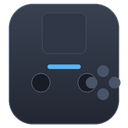
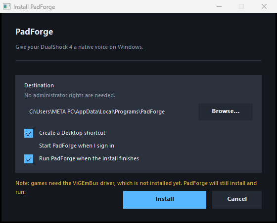

<p align="center">
  
</p>

<h1 align="center">PadForge</h1>

**به دسته‌ی DualShock 4 روی ویندوز، صدای بومی بدهید.**

> [English](README.en.md)

بازی‌های ویندوز با XInput حرف می‌زنند. دسته‌ی DualShock 4 با HID. همین ناهمخوانی
دلیل وجود این برنامه است: PadForge گزارش واقعی HID دسته را می‌خواند، هر محور را
بازشکل می‌دهد، هر دکمه را دوباره نگاشت می‌کند، و نتیجه را به‌صورت یک دسته‌ی مجازی
Xbox 360 منتشر می‌کند که هر بازی از قبل می‌داند چطور با آن حرف بزند.

نوشته‌شده با Rust، با رابط کاربری egui که برای تنظیم کردن ساخته شده، نه برای نمایش.

---

## چه کاری انجام می‌دهد

- **می‌خواند واقعی.** هر دو چیدمان گزارش HID (USB و بلوتوث) مستقیماً از بایت‌های
  خام رمزگشایی می‌شوند: آنالوگ‌ها، تریگرها، تاچ‌پد، حسگرهای حرکتی و باتری.
- **هر محور را شکل می‌دهد.** دد‌زون، منحنی پاسخ (خطی، نمایی، بزیه سفارشی، پله‌ای)،
  ضد دد‌زون، حساسیت، معکوس‌سازی و هموارسازی زمانی — به‌صورت یک زنجیره‌ی چهار مرحله‌ای
  ثابت.
- **همه‌چیز را نگاشت می‌کند.** هر کنترل DS4 به هر دکمه‌ی XInput، با امکان شرط‌گذاری
  روی کلیدهای تغییردهنده. دو چیدمان آماده، یا تنظیم دستی.
- **کلیک آنالوگ را شبیه‌سازی می‌کند.** هر جهت آنالوگ را به L3/R3 می‌بندد، همان‌طور که
  کلیک خود دسته کار می‌کند.
- **هدف‌گیری حرکتی.** ژیروسکوپ به ماوس، به هر دو آنالوگ، یا به تریگرها؛ با دد‌زون،
  محدودیت نرخ، سقف بهره و سه راه هموارسازی شامل فیلتر ۱ یورو. خروجی ماوس از مسیر
  `SendInput` می‌رود، پس همان بررسی‌های UIPI را مثل سخت‌افزار واقعی دارد.
- **مسیریابی تاچ‌پد.** به‌صورت اشاره‌گر، D-pad یا ژست؛ کلیک دسته به دکمه‌ی چپ یا
  راست ماوس نگاشت می‌شود.
- **پروفایل‌ها.** بسته‌ی کامل تنظیمات به‌ازای هر بازی، با تعویض دستی، کلید میان‌بر یا
  خودکار وقتی برنامه‌ای به جلو می‌آید. ورود و خروج به‌صورت JSON.
- **نور نوار.** رنگ، روشنایی و انیمیشن (ثابت، تنفس، چشمک، رنگینکمان، آبی، محو‌شدن)،
  نوشته‌شده به‌-back روی دسته.
- **کالیبراسیون.** مرکز هر آنالوگ را خودش یاد می‌گیرد، پس آنالوگ فرسوده هم وسط
  درست خوانده می‌شود.
- **کم‌مزاحمت می‌ماند.** آیکون نوار اعلان، بستن به tray، کلید توقف کلی، میان‌برهای
  سراسری با رابط ضبط داخل برنامه، و اجرای خودکار بدون نیاز به دسترسی مدیر.

## پیش‌نیازها

- ویندوز ۱۰ یا ۱۱.
- درایور مجازی **ViGEmBus**، تا ورودی به بازی‌ها برسد. بدون آن PadForge اجرا می‌شود و صفحه
  Output هم همین را می‌گوید.
  - نسخه‌ی ۶۴ بیتی: <https://github.com/nefarius/ViGEmBus/releases>

## نصب

فایل `PadForge-Setup.exe` را اجرا کنید. یک پنجره‌ی کوچک باز می‌شود: محل نصب را
انتخاب می‌کنید (یا همان پیش‌فرض را می‌گذارید) و تیک میزنید که شورتکات دسکتاپ و اجرای
خودکار بسازد یا نه.

نصب برای حساب کاربری خودتان است و **هیچ دسترسی مدیر لازم ندارد**. در مسیر
`%LOCALAPPDATA%\Programs\PadForge` نصب می‌شود و خودش را در **Settings ‹ Apps** ثبت
می‌کند تا از همان‌جا قابل حذف باشد.

پروفایل‌های شما در `%APPDATA%\PadForge` دست‌نخورده می‌مانند، پس اگر دوباره نصب کنید
همه‌چیز سر جایش است.

برای نصب بدون پرسش (مثلاً با اسکریپت یا مدیریت مرکزی):

```
PadForge-Setup.exe /S                 نصب سیلنت با پیش‌فرض‌ها
PadForge-Setup.exe /D=C:\PadForge     نصب در مسیر دلخواه
PadForge-Setup.exe --uninstall        حذف
PadForge-Setup.exe --help            راهنما
```

گزینه‌ها: `--no-desktop-shortcut`، `--autostart`، `--no-launch`.



پنجره‌ی نصب با GDI بومی ویندوز رسم می‌شود، نه با یک toolkit گرافیکی: هم بدون
وابستگی اضافه است و هم روی هر ماشینی کار می‌کند، حتی اگر درایور گرافیک مشکل
داشته باشد.

## ساختن از سورس

```sh
cargo build --release
```

خروجی در `target/release/padforge.exe` است. برای اجرای پنهان در نوار اعلان:

```sh
padforge.exe --tray
```

برای ساختن اینستالر:

```sh
build-installer.cmd          # ویندوز
```

خروجی یک فایل `dist/PadForge-Setup.exe` است که خودِ برنامه داخلش جاسازی شده. با Cargo
هم دو دستور است، و ترتیب مهم است چون دومی خروجی اولی را جاسازی می‌کند:

```sh
cargo build -p padforge --release
cargo build -p padforge-installer --release
```

اینستالر با GDI بومی ویندوز نوشته شده، نه با یک toolkit گرافیکی: هم بدون وابستگی
اضافه است و هم روی هر ماشینی کار می‌کند، حتی اگر درایور گرافیک مشکل داشته باشد.

## تست

```sh
cargo test --workspace
cargo clippy --workspace --all-targets
cargo fmt --all -- --check
```

مجموعه‌ی تست روی بخش‌هایی تمرکز دارد که خطای ظریف در آن‌ها تا وقتی بازی به‌هم نریخته
دیده نمی‌شود: رمزگشایی گزارش HID برای هر دو ترابری، زنجیره‌ی فیلتر در مرزها، انتگرال
ژیرو و فیلترهایش، تشخیص ژست و مسلح‌شدن دوباره، ناوردایی‌های ذخیره‌ی پروفایل، و گرد
کردن گزارش.

یک مجموعه‌ی کارایی هم هست که به‌طور پیش‌فرض نادیده گرفته می‌شود تا `cargo test` سریع
بماند:

```sh
cargo test -p padcore --release --test perf -- --ignored --nocapture
```

DS4 تا ۱۰۰۰ هرتز گزارش می‌دهد، پس کل زنجیره‌ی هر گزارش یک میلی‌ثانیه در ثانیه وقت
دارد. اندازه‌گیری‌شده روی ماشین بی‌کار، بیلد release:

| مرحله | هر نمونه |
|---|---|
| فیلتر محور، هموارسازی نمایی | ۷۵ ns |
| فیلتر محور، پنجره‌ی وزنی ۱۶تایی | ۸۲ ns |
| انتگرال ژیرو + فیلتر | ۷۲ ns |
| ژیرو به اشاره‌گر | ۱۲۷ ns |
| مسیریابی تاچ‌پد | ۲۹ ns |
| **چهار محور + ژیرو + اشاره‌گر، کل حلقه** | **۶۲۶ ns/فریم** |

یعنی حدود ۱۶۰۰ برابر زیر بودجه‌ی فریم، یا ۰.۰۶ درصد یک هسته. مسیر داغ همچنین
**صفر تخصیص حافظه** را بعد از گرم شدن assert می‌کند، چون تخصیص در هر گزارش به‌صورت
جیتر در نخ HID خودش را نشان می‌دهد، خیلی قبل از آنکه در اعداد توان دیده شود.

## وضعیت

کامل و تست‌شده: ۱۳۰ تست پاس می‌شود، `cargo fmt` و `cargo clippy` زیر `-D warnings`
تمیز است، و rustdoc بدون هشدار ساخته می‌شود. CI همه‌ی این‌ها را روی هر push اجرا
می‌کند.

**روی سخت‌افزار واقعی تست شده.** یک DualShock 4 v2 روی بلوتوث وصل شد و چهار باگ
جدی آشکار شد که هیچ تست واحدی نتوانسته بود پیدایشان کند — چون هر چهار، دادهٔ تمیز
تولید می‌کردند و هیچ‌کدام خطا نمی‌دادند:

- report id بلوتوث `0x11` است نه `0x01`، پس همهٔ فریم‌ها دور ریخته می‌شدند و دسته
  «قطع‌شده» به نظر می‌رسید.
- offset آنالوگ بلوتوث ۳ است نه ۴ — با offset اشتباه، D-pad به‌عنوان محور آنالوگ
  راست خوانده می‌شد.
- **ژیرو و شتاب‌سنج جابه‌جا بودند.** روی دستهٔ ساکن، شتاب‌سنج ۰.۰۰۳g می‌خواند؛
  حالتی که یک دسته نمی‌تواند در آن باشد. درست ۰.۹۹g می‌خواند.
- یک DS4 بلوتوثی چند کالکشن HID را هم‌زمان expose می‌کند. کد اولین آن‌ها را باز
  می‌کرد — که باز می‌شود و بعد **برای همیشه در `read` قفل می‌ماند**. حالا
  اینترفیس‌های خاموش شناسایی و رد می‌شوند.

همان باگ سوم دلیل حرکت خودسرانهٔ ماوس بود: offset اشتباه ژیرو را صدها برابر بزرگ
می‌خواند و مستقیم به `SendInput` می‌رفت. اندازه‌گیری روی دستهٔ ساکن: **۶ پیکسل در
دو ثانیه**، که پیش از آن به سمت هزاران پیکسل می‌رفت.

اندازه‌گیری نهایی روی همان دسته: **۵۲۹ گزارش در ۷۵۵ هرتز** روی بلوتوث، با فاصلهٔ
۱.۳۳ms بین فریم‌ها.

نکتهٔ روشی: بایت‌های تست مستقیماً از دستگاه گرفته شده‌اند و
`cargo run -p padcore --bin capture-fixture` آن‌ها را بازتولید می‌کند. تست‌ها به‌جای
برابری بایت، **امکان‌پذیری فیزیکی** را می‌سنجند: دستهٔ ساکن باید حدود ۱g بخواند، و
نه ۰g و نه ۴g حالتی نیست که یک دسته بتواند در آن باشد. یک fixture دستی‌نویس‌شده
دقیقاً همان چیزی است که باگ را در تست تثبیت می‌کند.

یک چیز هنوز **تأیید نشده**: ظاهر واقعی رابط کاربری. هر پنجره‌ی egui/glow روی ماشینی
که این روی توسعه داده شده به‌صورت مستطیل سفید رندر می‌شود. آن یک مشکل درایور
گرافیک است نه مشکل برنامه — یک نمونه‌ی کوچک egui که هیچ کد مشترکی با PadForge ندارد
دقیقاً به‌هم شکل سفید رندر می‌شود. جزئیات کامل در
[issue #1](https://github.com/Ekkh1300/PadForge/issues/1).

چهار قابلیت از DS4Windows هم هنوز پورت نشده‌اند، فهرست در
[issue #2](https://github.com/Ekkh1300/PadForge/issues/2).

## داده‌ها کجا ذخیره می‌شوند

هر چیزی که PadForge می‌نویسد زیر `%APPDATA%\PadForge` است:

```
settings.json      تنظیمات برنامه
profiles/          پروفایل‌ها، به‌همراه هر پروفایل واردشده
logs/              فایل لاگ
```

پاک کردن آن پوشه یعنی حذف کامل داده‌ها.

## ساختار پروژه

```
crates/
  padcore/         موتور، بدون هیچ وابستگی رابط کاربری
    report.rs      رمزگشایی گزارش HID دسته DS4
    device.rs      شناسایی و جریان داده
    filters.rs     دد‌زون / منحنی / هموارسازی
    gyro.rs        انتگرال حرکت و فیلترها
    pointer.rs     ژیرو و تاچ‌پد به ورودی واقعی ماوس
    touchpad.rs    مسیریابی تاچ‌پد و ژست‌ها
    mapping.rs     نام‌گذاری کنترل‌ها و مقصدها
    output.rs      انتشار دسته‌ی مجازی
    profile.rs     پروفایل‌ها و ذخیره‌سازی
    engine.rs      حلقه‌ای که همه را به هم می‌دوزد
  padforge/        برنامه‌ی egui
    app.rs         پنجره، ناوبری، مسیریابی صفحه‌ها
    theme.rs       پالت و استایل ابزارها
    widgets/       پیش‌نمایش زنده دسته، نوارها، انتخاب رنگ
    pages/         یک ماژول برای هر صفحه
  padforge-installer/
    main.rs        نصب، حذف، پردازش آرگومان‌ها
    gui.rs         پنجره‌ی نصب‌کننده
    gdi.rs         کمک‌کننده‌های رسم GDI
    win.rs         شورتکات‌ها و رجیستری per-user
    build.rs       جاسازی padforge.exe در اینستالر
```

سه نخ با یک تقسیم عمدی:

```
نخ HID              نخ موتور                     نخ رابط
+-------------+   +---------------------------+     +------------+
| decode      |-->| filter -> map -> output   |---->| telemetry  |
| report      |   | gyro, touchpad, lightbar |     | commands   |
+-------------+   +---------------------------+<----+------------+
```

ریاضیات اشاره‌گر در `pointer.rs` یک پورت عمدی از `MouseCursor` در DS4Windows است، شامل
این نکته که ژیرو نرخ می‌دهد نه زاویه، و اینکه باقیمانده باید به سمت صفر بریده شود نه به
سمت پایین — وگرنه حرکت منفی هر صدبار یک واحد biases می‌گیرد.

## مجوز

MIT. این پروژه از صفر و با رویکرد clean-room نوشته شده است: ایده‌ی DS4Windows (خواندن
DualShock 4 و معرفی آن به‌عنوان Xbox 360) از رفتار آن مطالعه شد، اما هیچ کدی کپی نشده.
جزئیات رفتاری از سورس منتشرشده‌ی DS4Windows و از مشاهده‌ی گزارش‌های HID استخراج شد.

ViGEmBus یک پروژه‌ی جدا با مجوز جداگانه از nefarius است و همراه PadForge توزیع
نمی‌شود: <https://github.com/nefarius/ViGEmBus>